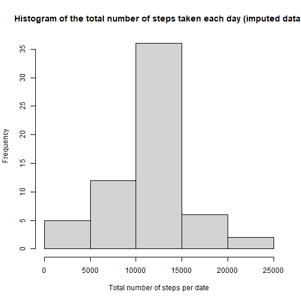

## Loading and preprocessing the data

``` r
if(!file.exists("activity.csv")) {
  unzip(zipfile = "activity.zip")
}
data <- read.csv("activity.csv")
data$date <- as.Date(data$date)
```

## What is mean total number of steps taken per day?


Mean total number of steps taken per day: 10766  
Median total number of steps taken per day: 10765  

## What is the average daily activity pattern?


The 5-minute interval that, on average, contains the maximum number of steps: 835  

## Imputing missing values

The total number of missing values in the dataset is: 2304  
We create a new dataset, where missing values are replaced with the average number of steps for that interval across all days.  

``` r
imputed_data <- data
imputed_data$steps[is.na(imputed_data$steps)] <- interval_average$steps[match(imputed_data$interval[is.na(imputed_data$steps)], interval_average$interval)]
```


Mean total number of steps taken per day (imputed data): 10766  
Median total number of steps taken per day (imputed data): 10766  
The results did not change much after imputing (only the median value increased slightly).
That might be due to the fact that we used average value of each interval for imputing.  

## Are there differences in activity patterns between weekdays and weekends?

